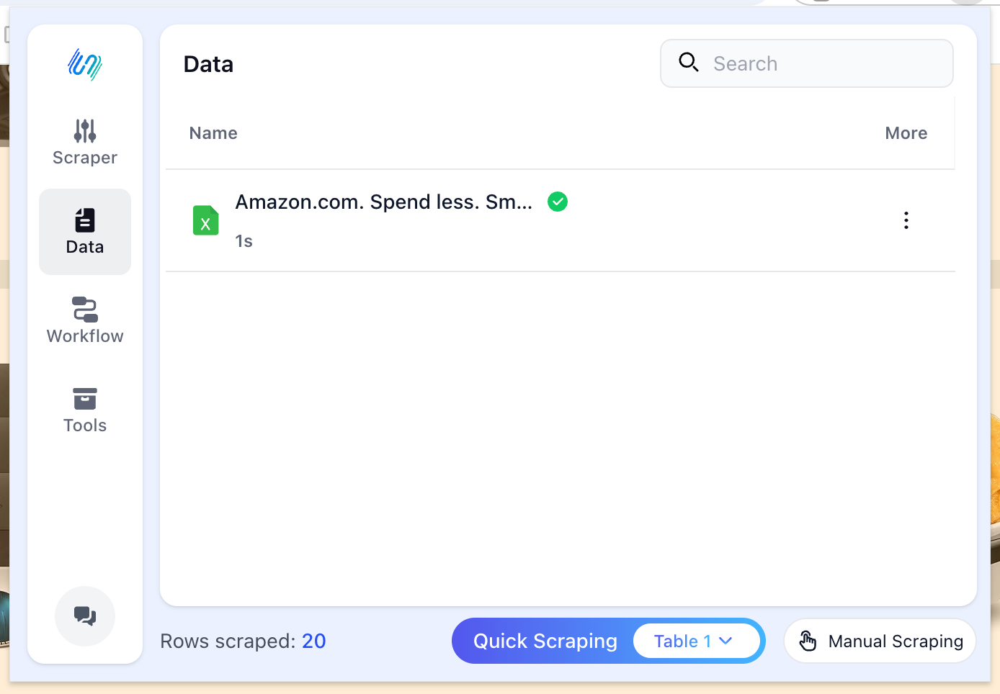
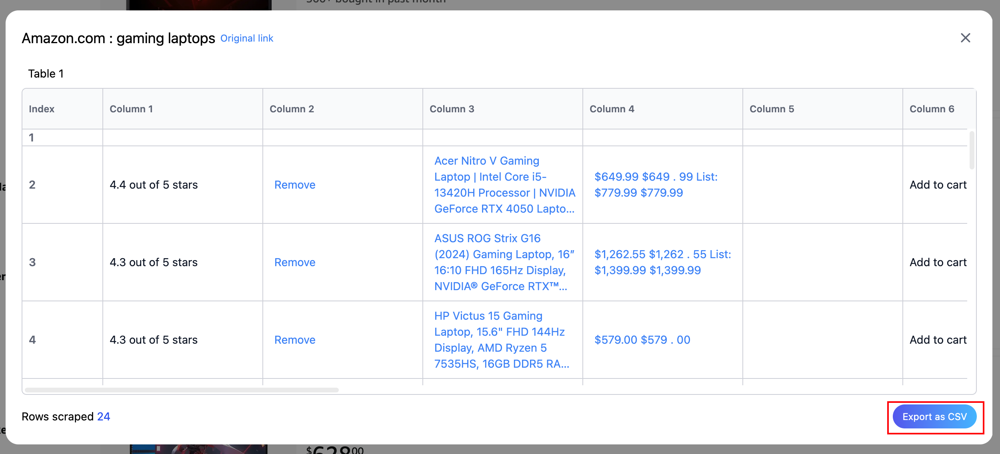

# 4. Data Management

All scraped table data is displayed in the list under the `Data` tab.

You can view your tables in this list, whether they were scraped using `Scraper`, `Workflow`, or `Quick Scraping`.

## 4.1 View Table Details

Click on an item in the list to view the table details.

## 4.2 Export Table as CSV

We also support exporting tables as **CSV** files for easy data sharing and use.
