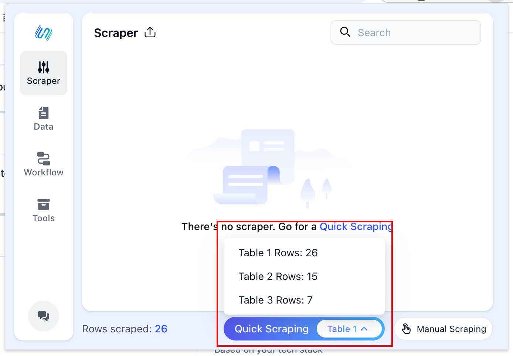
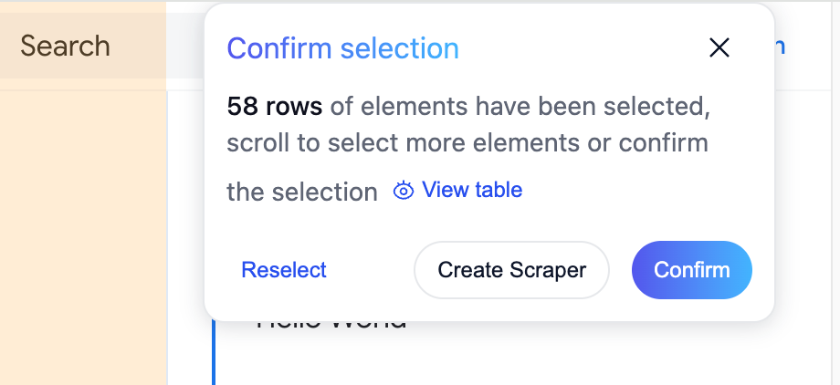
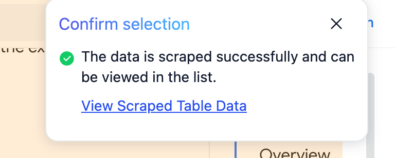

# Scraping your first table with **Clipsheet**

To find extension icon on the chrome `Navbar` after we install **Clipsheet**.

And navigate to a webpage you're interested in and open **Clipsheet**. You will then see the main interface of **Clipsheet**.

You can see that **Clipsheet** has automatically detected the tables on this page. Browse through the list of tables to find the one with the data you need.

If the detected tables are not what you're looking for, click the `Manual Scraping` button to select the element you want to scrape.

Click the `Quick Scraping` button.

You will see a panel in top of left side on you browsing webpage

Click the `Confirm` button.

You have successfully scraped your first table with **Clipsheet**. You can view the scraped table data by clicking the `View Scraped Table Data` button.
