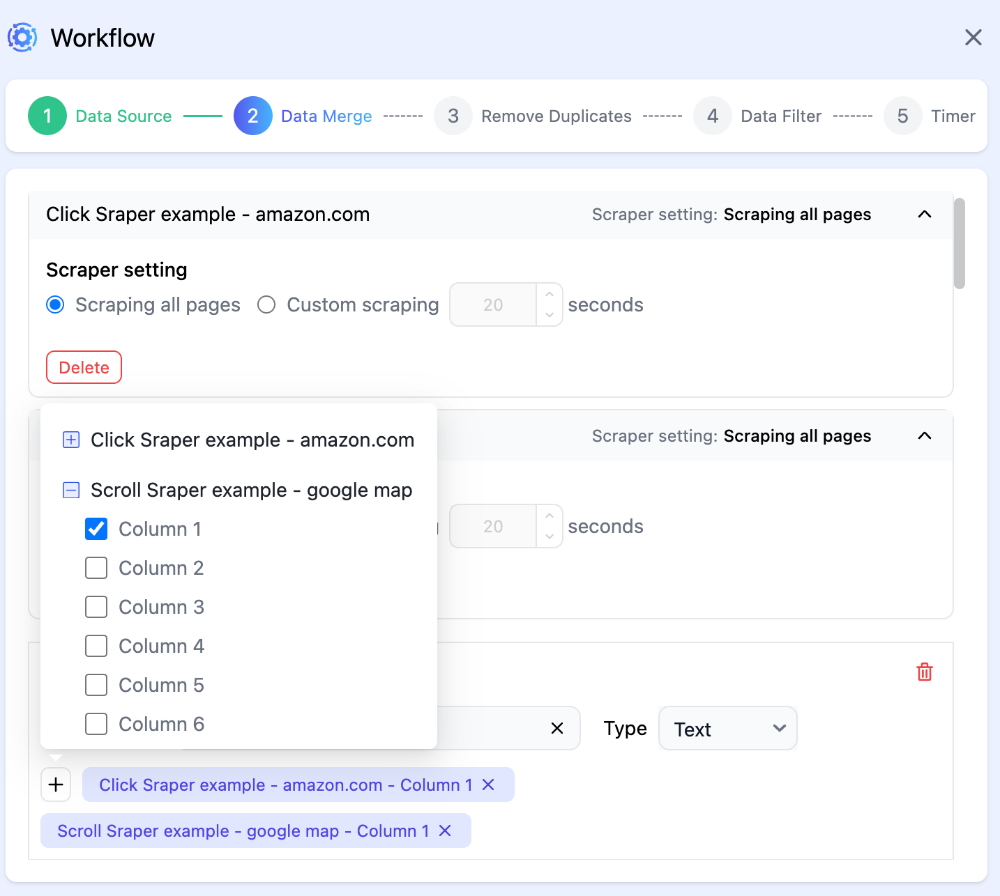

# 6. Workflow

Although web scraping can usually be executed with a single click in most scenarios, there are times when we prefer to schedule or run specific scraping tasks periodically.

In such cases, we need a ****workflow**** to automate these tasks.

A **workflow** is a combination of multiple scrapers. Running a **workflow** will execute all the scrapers it contains, and you will be able to **integrate** the data from all scrapers for further processing.

Below, we will introduce several key features of workflows, including scheduled execution, incremental data updates to bound data sources, and integration of multiple scrapers.

## 6.1 Bind Workflow Data Source

A **workflow** can be linked to a data source. If no data source is defined, a new data source will be automatically created and bound after the **workflow**'s first execution.

> **Note:** When a **workflow** is bound to a data source, the columns of the data source will be set to the **workflow** and cannot be modified. (This is because once a data source is created, its table structure is immutable.)

Once a **workflow** has bound a data source, the workflow’s output data will be appended to this data source, and duplicate rows will be automatically removed.

You can customize the configuration for removing duplicates.

## 6.2 Combine with Scrapers

A **workflow** is a collection of multiple scrapers working together.

You need to define the **workflow** based on the scrapers that make up the **workflow**. For example, in the following setup, we configure the **workflow** to include the `Amazon Scraper` and `Google Maps Scraper`.

Next, we need to determine how each column in the **workflow** is mapped to the corresponding column from each **scraper**.

## 6.3 Scheduled Execution

For scheduled execution, we provide a highly customizable scheduling configuration, allowing you to set the exact times for your **workflow** to run.

Scheduled execution of workflows is a powerful feature that helps you fulfill your web scraping needs.
