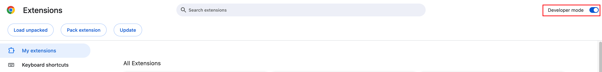

# 快速入门

## 1. 安装

要体验 Clipsheet 的功能，请点击 [Clipsheet Releases](https://github.com/dream-num/univer-clipsheet/releases) 获取最新版本的 Clipsheet，并按照以下步骤使用“加载已解压的扩展”。

## 1.1 解压

第一步是解压刚刚下载的压缩文件。

## 1.2 进入扩展管理页面

“打开 Chrome 浏览器，在地址栏中输入 `chrome://extensions/`。”

## 1.3 打开开发者模式

在导航栏右侧找到开发者模式切换按钮并打开它。

## 1.4 加载文件夹作为扩展

点击 `加载已解压的扩展` 按钮，选择 Clipsheet 文件夹来加载扩展。

## 1.5 教程

如果您仍然无法正确安装 Clipsheet，我们已准备好文档和视频帮助您完成安装过程。

请阅读 [加载已解压扩展文档](https://developer.chrome.com/docs/extensions/get-started/tutorial/hello-world#load-unpacked) 了解更多信息。
观看这个 [视频教程](https://www.youtube.com/watch?v=oswjtLwCUqg)，了解如何加载扩展的详细解释。
